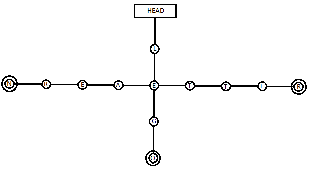
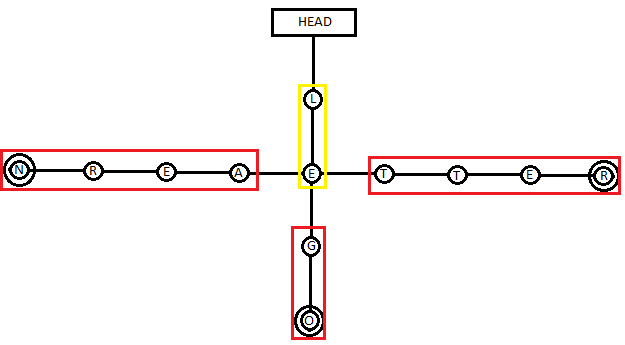
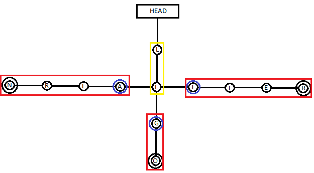

# hash-trie
**A somewhat configurable and customizeable Prefix-Tree aka. Trie data structure in C**


## Why?
A Trie is a somewhat common Data structure which optimizes not only Storage but also retrieval of Strings. This library aims to simply the creation and usage, with [macros](#macros), as well as performance of said data structure with the use of [hashes](#hashing).

## Features
- [x] Initialize a Trie successfully
- [x] Trie Management
    - [x] Creation of the Trie
        - [x] Provide a way to customize the size
        - [x] Provide a way to rearrange the sorting of items
    - [x] Searching for a String
        - [x] Provide a reference to the node found to be the end
        - [x] Provide a reference to the previous node
    - [ ] Deleting a String
- [ ] Hashing
    - [ ] Skip characters with only one child node (Unique Strings)
    - [ ] Hash search query while searching through Trie normally

## Macros
Have to be defined before the inclusion of the trie.h header.


### OPTN
Allows the adding of optional variables to the trie_t struct.
To add a variable you have to use the conventional C declaration.
For example to store some Enum for each of the stored Strings, you may do so using
```C
#define OPTN int some_enum;
#include <trie.h>
```

### TRIE_CASE_INSEN
In order to save memory, you may use this Option in order to Case insensitivize the Trie. This means that instead of creating separate Nodes for the same upper and lower characters, all characters are converted to uppercase. This saves the need for about 25 Nodes, which shrinks the size from 776 Bytes to 576 Bytes. For example the word "Alligator" would take up around 1800 Bytes less! Consider using this when Case sensitivity doesn't matter.
```C
#define TRIE_CASE_INSEN
#include <trie.h>
```

### TRIE_CHARS
Controls how many different Characters the Trie can store.
**This Option is automatically adjusted to fit the size requirements of `TRIE_CASE_INSEN` _ONLY_ when it is not set by the user!**

### TRIE_NORM(c)
This is a very important Macro, as it is "normalizing" the input ASCII characters to only use those which are actually human readable characters. These are ASCII values 32 ("whitespace") to 126 ("~") and sets any characters not within this area to the runoff area determined by `TRIE_CHARS + 1` and cancels the adding of the String (behaviour might change). **If `TRIE_CHARS` is adjusted to a user specified value, this Macro will most likely need to be adjusted.**

## Hashing
As the name of this project implies, Hashes play an important role.
In this case, they are used to speed up the process of completing the query and speed up the process of searching significantly.

### Theory
A Trie works in a rather simple way: each Node represents a letter, each following node does the same. Nodes or Letters that have been used once can be used twice. As such the amount of total individual letters needed to store CAT and CATTLE is reduced by 3, since CAT fits perfectly into **CAT**TLE and vice versa.



_**The words LEGO, LEARN and LETTER as en example; Ends are marked with a double circle.**_


However some word are rather unique and long or there are little words to work with. In such cases there will be large pieces, or even entire words, spread out across nodes which all need to be traversed to confirm whether or not a word actually exists.



_**AERN, GO and TTER don't have child nodes; traversing them makes little sense**_


However if a Hash of the full word can be stored at the Nodes which are deciding what word there is (marked with a blue circle), recognized by the `trie_search()` function and used to verify the query word, the search can be stopped prematurily and assumed correct.



_**Nodes A, G and T contain the Hash of the full word. ERN, O and TER, respectfully, aren't traversed**_

### Placebo?
Most likely. I still haven't confirmed the benefit over using a conventional Trie (as the code doesn't exist at the time of writing this very sentence).
If it is, then at least I will have created a Trie that can verify for String integrity.

## Licenses
This project [uses the GNU GPLv3 License](LICENSE). 

Each File that contains Code that was written by me has a Notice at the top with the full notice at it's bottom.